# 规则开发
## 准备工作
第一步，您需要使用win操作系统，并且已经安装了Edge或者Google Chrome浏览器，亦或是其余您个人喜好的PC浏览器。
> **备注**：其他平台若是可正常在网页内调出开发者工具亦可，安卓平台同理，但考虑到后续的操作便利，还是建议您使用PC进行操作。

第二步，安装好最新版的Kazumi，打开后依次点击`我的`-`规则管理`-右上角`+`-`新建规则`。

第三步，打开你需要自定义规则的网页，找到其搜索栏，键入任意番剧关键词进行搜索。若不提示验证码验证或者二次跳转等人机验证，即可进行下一部分操作，否则此网页不支持规则开发。

> **备注**：您不需要在此教程中寻找最终的代码，此教程中的示例代码会放在下一篇`规则示例`中。您可以点击界面右侧的页面导航进行快速跳转，以定位到您想看的内容！


## 规则编辑器界面

按照准备工作的第二步打开对应界面，你应该能看见下图界面。
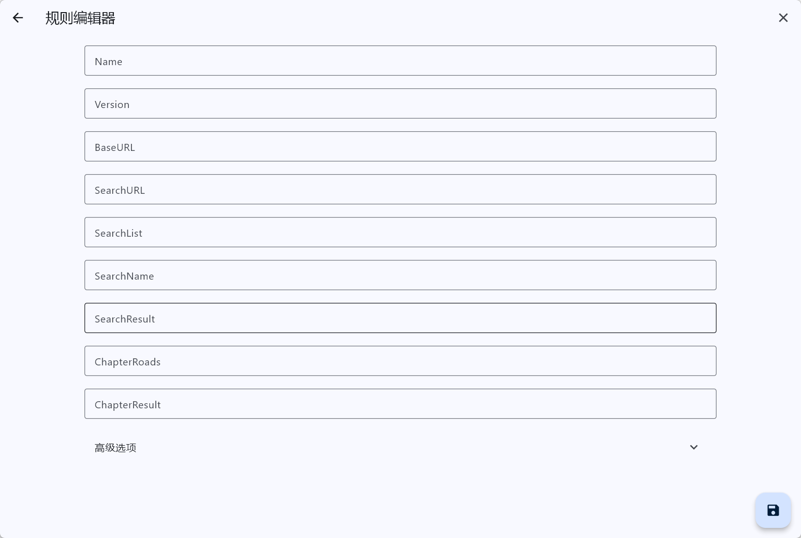

现在，我将逐行解释对应的内容是什么，需要填什么。
> **备注**：这里先不讲解高级选项里的内容，后续会单独说明

这里以 https://www.dm539.com/ 为例子。
> **备注**：为了使读者更加易于阅读，下文的结构均为：`名字` 在前，解释在后。不要看叉了哟

### `Name`

Name行，也就是这个规则的名字，如果是自己使用，怎么写都行，一般是网站名称或者网址，无强制要求。

### `Version`

Version行，也就是版本号，若是自用则无强制要求，若需要贡献到仓库，建议填写1.0方便后续规则升级。

### `BaseURL`

BaseURL行，也就是能正确访问的网址，对于此教程来说，也就是 https://www.dm539.com/   
  一般来说，一个网页的地址可以在标签栏下方找到，如下图：


### `SearchURL`

SearchURL行，也就是当你在kazumi内键入关键词时，其需要调用的搜索链接。  
你可以简单理解为：当需要进行搜索时，就访问此链接，而非单纯访问网站本身。

你需要在刚刚打开的网页上键入关键词进行搜索，比如这里我输入“紫罗兰永恒花园”然后进行搜索。  

这样我们就可以得到搜索链接，如下图：
  
  
    

复制这一串链接，在此行粘贴，粘贴后如下图：
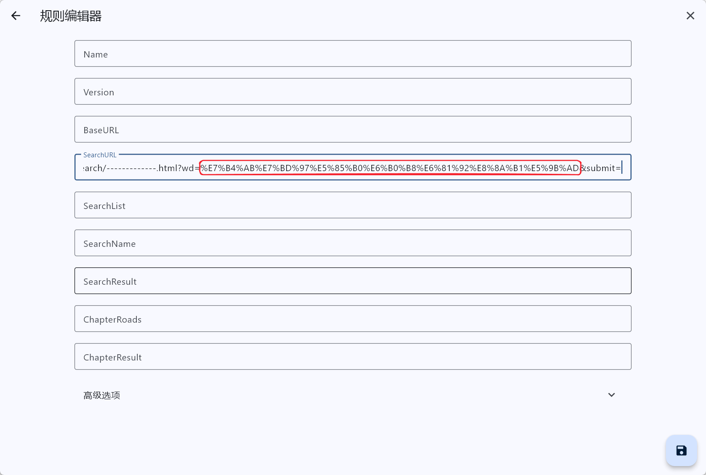  

在软件里面粘贴后，其不会显示“紫罗兰永恒花园”这几个字，其会显示一串编码，这个编码是URL编码，它可以被浏览器正常解读，但是在软件里面不行。（具体可见上图红框部分）  
不过这都不重要，我们只需要将这段编码人为替换为`@keyword`即可  
其替换完成后应该为：
```
https://www.dm539.com/search/-------------.html?wd=@keyword&submit=
```
即我们需要将上述地址填入`SearchURL`行
> **备注**：一些网站是以POST的方式进行搜索，即你无法通过键入关键词获得搜索链接，比如 https://www.mengdao.tv/ 这部分的解决方法会在后面单独说明

### `SearchList`

从此行开始，需要填入Xpath语法，并且使用到开发者工具，不过不必担心，阅读此文档可助你轻松完成。  
这行的意思就是，在键入某个关键词并进行搜索以后，所得到的搜索结果。  
假如你刚刚有搜索“紫罗兰永恒花园”，你应该会得到以下界面：
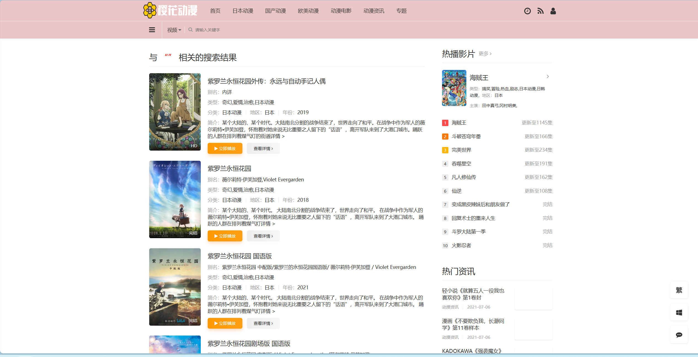

在此界面按F12呼出开发者工具，呼出后，根据个人喜好调整窗口大小。点击下图所示图标：
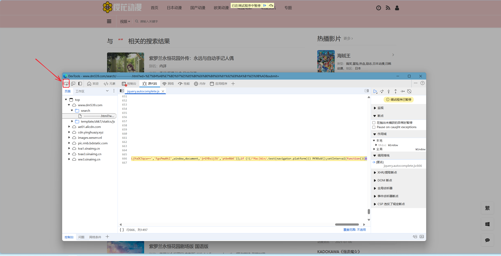

然后点击任意搜索结果中，番剧的名字，这样你应该可以在`元素`界面看见此名字对应的HTML代码，如下两图：

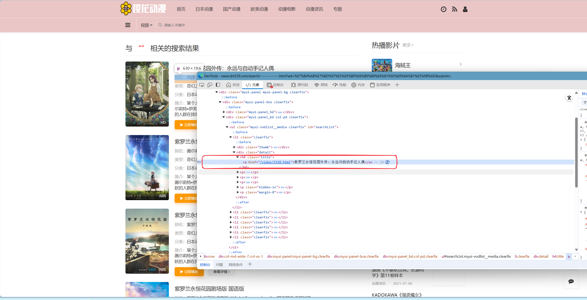

完成上一步后，将你的光标由当前选中行，由下至上放置（注意是放置不是点击！说人话就是放上去但不点），直至观察到左侧浅蓝色色块覆盖整个搜索结果，包括图片。  
此刻再点击当色块覆盖住完整搜索结果时，其对应的HTML代码左侧的小箭头，将其折叠。如下图中红色圆圈对应位置：
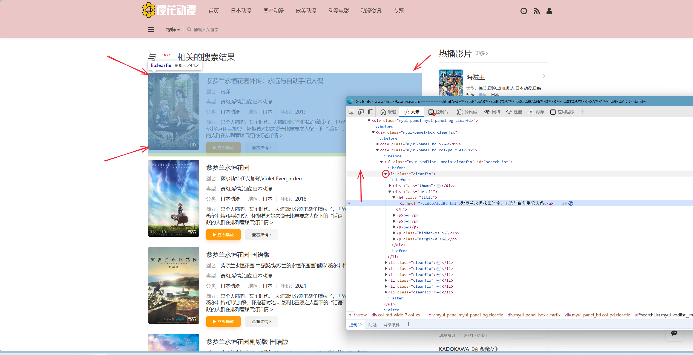

折叠后，你应当能看见几个长度一致，且以`<li`开头的代码。并且，若你将光标由上至下进行放置，你应该能发现，浅蓝色色块也是随着滑动而进行改变。并且网页内有几个搜索结果，同理就应该有几个以`<li`开头的代码。见下图：
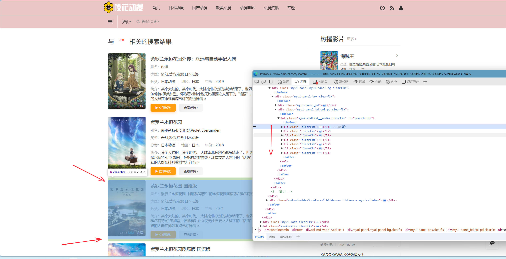


重点来了，找到这几个长度一致的代码中，第一个`<li`，将光标往上滑动，直至左侧浅蓝色色块覆盖**所有**搜索结果。通常来说，从第一个往上滑动一至两行即可找到包含子级`<li`的父级。点击其父级代码左侧的三个点，圆圈标注。如下图：
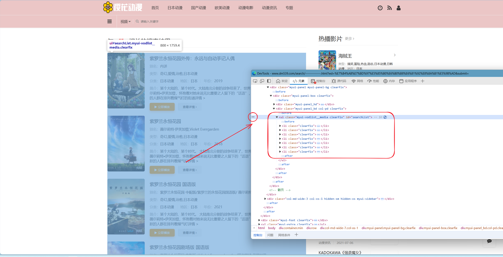

如下图，按照图中标示进行复制：
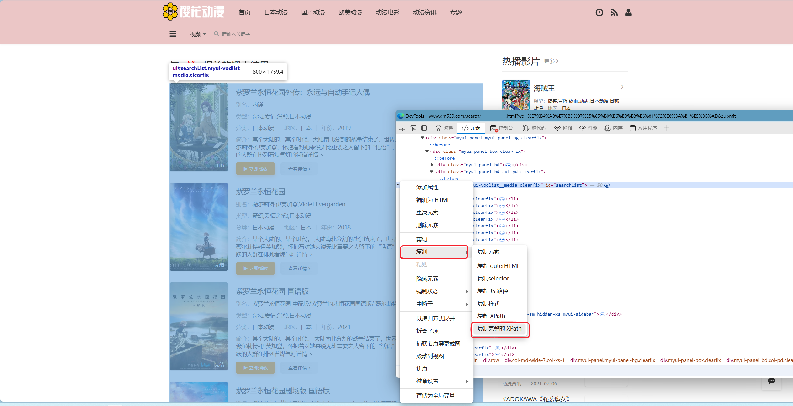

复制后，在软件内粘贴，你应该得到以下代码：
```Xpath
/html/body/div[1]/div/div[1]/div/div/div[2]/ul
```

如果与上述不一致，检查一下前面步骤是否有错误  
然后需要删除`/html/body`并且多打一个`/`完成后应该是下面这样：
```Xpath
//div[1]/div/div[1]/div/div/div[2]/ul
```
那么这个语句的意思就是定位到“容器”`ul`本身，但我们的搜索结果是位于容器`ul`下以`li`命名，我们要找的是`li`。所以，我们应该在这句语法的最后加上`//li`完成后应该是下面这样：
```Xpath
//div[1]/div/div[1]/div/div/div[2]/ul//li
```
即，SearchList行应该填入上述代码
> 小提示：此例子中父级容器为`ul`，子级搜索结果为`li`，但是不同网页结构是不一样的，其他网页或许会使用`div`，`li`，`a`，`ul`等，这里需要灵活变通！在此例子中，如果子级搜索结果是以`<div`开头那么最后加的就是`//div`

同时，我们可以摈弃上述冗长的写法，改用以下代码：
```Xpath
//li[@class='clearfix']
```

这个语句的意思就是：找到所有`class`为`clearfix`的列表项`li`元素。  
那为什么是`//li`？为什么是`clearfix`?  
因为它代码是这样写的`<li class="clearfix">`

假如是`<div class="clearfix" id="playlist">`  
则可以这样写
```Xpath
//div[@id='playlist']
```

### `SearchName`

这一行就是指引软件，在我们上一步骤所定位到的所有搜索结果中，找到对应结果的名字。因为我们上一步找到的是包含了番剧信息、番剧图片、番剧详情页、番剧播放页链接等一系列信息，这一步只需要番剧名字。  
只需要如上一步一样，点击红色圆圈标注，再点击任意名字，通常是点击第一个，之后点击对应代码左侧的三个点，按照标注进行复制，如下图所示：
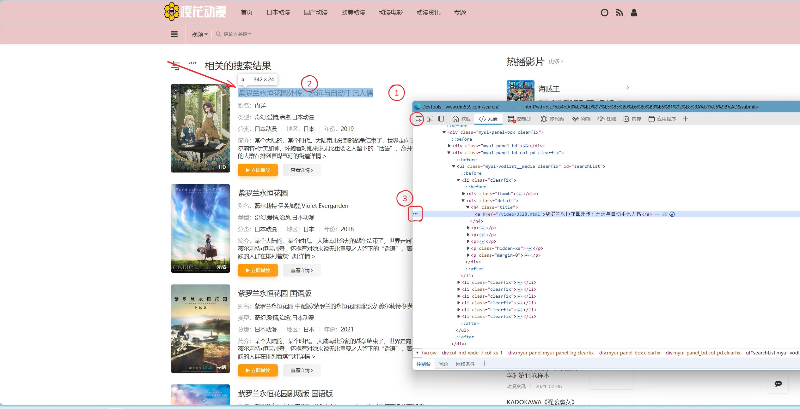
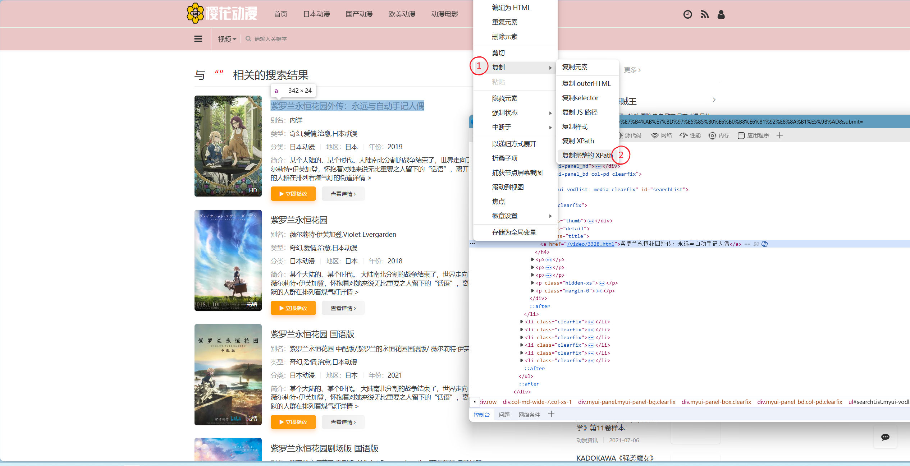

若你是按照上图路径进行复制，你应该会得到以下代码：
```Xpath
/html/body/div[1]/div/div[1]/div/div/div[2]/ul/li[1]/div[2]/h4/a
```
一样的，删除`/html/body`并且多打一个`/`，保证以`//`开头，完成后如下：
```Xpath
//div[1]/div/div[1]/div/div/div[2]/ul/li[1]/div[2]/h4/a
```
我们将此语句与上一步list中的语句进行对比：
```Xpath
//div[1]/div/div[1]/div/div/div[2]/ul//li
//div[1]/div/div[1]/div/div/div[2]/ul/li[1]/div[2]/h4/a
```
可以发现，第二句与第一句有重复的部分，即`//div[1]/div/div[1]/div/div/div[2]/ul/li[*]`是重复的，*代表任意数字。  
所以我们需要删除重复的部分，为什么呢？举一个不恰当的例子，就好比你网购填地址时，系统已经选好了省市县，你只需要填写街道小区就行了，不需要再次重复填写省市县。对应这个教程，重复的部分就是“省市县”，我们只需要留下“街道小区”。完成后代码应该如下：
```Xpath
//div[2]/h4/a
```

### `SearchResult`

一样，按照下图标识进行点击，并复制对应Xpath，选择`复制`-`复制完整的Xpath`


复制完成后，你应该得到以下代码：
```Xpath
/html/body/div[1]/div/div[1]/div/div/div[2]/ul/li[1]/div[2]/p[5]/a[2]
```
与之前的Name处理相同，完成后你应该得到以下代码：
```Xpath
//div[2]/p[5]/a[2]
```

**重点来啦！**

此行`SearchResult`与`ChapterRoads`以及`ChapterResult`有着密切的关系！  
说人话就是`SearchResult`的内容决定了`ChapterRoads`以及`ChapterResult`的内容！  
`ChapterRoads`以及`ChapterResult`的内容随着`SearchResult`的内容改变而改变

假设你这里写的是`//div[2]/p[5]/a[2]`，那么软件会找到下面这个界面：
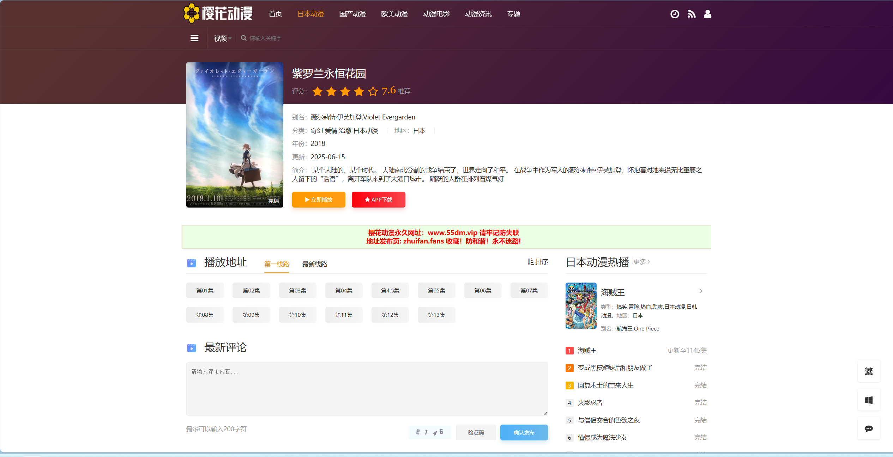

假设你这里写的是`立即播放`的Xpath语句，那么软件会找到下面这个界面：
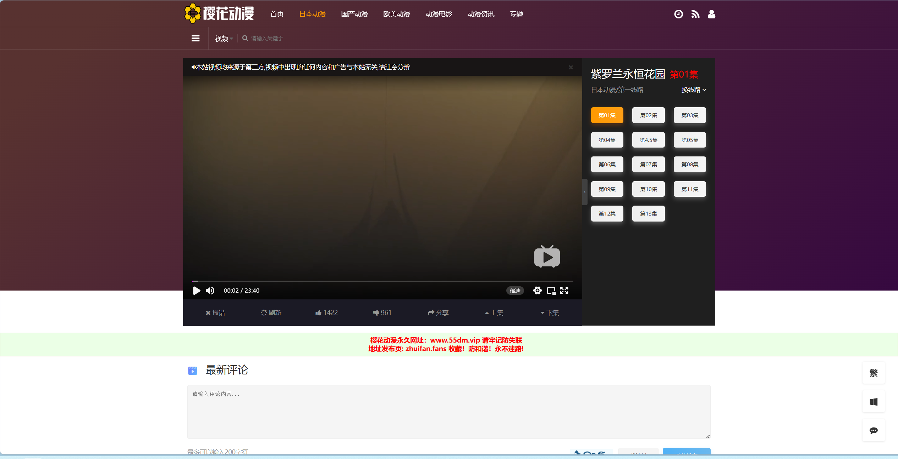

**我们要知道，这两个界面中，对应线路，集数，它的结构是不可能一样的。我们只有在这一行填写正确的语句，引导软件访问正确的界面，并且在这个界面中，根据我们在`ChapterRoads`以及`ChapterResult`写的语句，找到对应的线路，集数。这样才是正确的！所以，如果一些网站在搜索列表里，没有进入详情页的按钮，那么此处的语法就和上一处的SearchName一样！因为大部分网页点击名字是可以进入下一个界面的，只是说不确定是详情页还是播放页！**

### `ChapterRoads`

在上一步，我们引导了软件访问正确的详情页，也就是上一步骤中倒数第二张图。

这里的步骤其实与`SearchList`那里是一样的，根据下图序号依次点击：
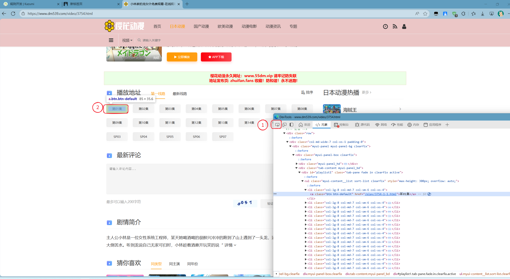

接着，光标由下至上滑动，但不点击，观察左侧淡蓝色色块覆盖所有集数后，将对应行折叠。观察对应线路，有几条线路，就一定有几行长度一样的代码，如果折叠后没有出现长度一样的，就再往上找，色块覆盖后再折叠，再观察，见下图：
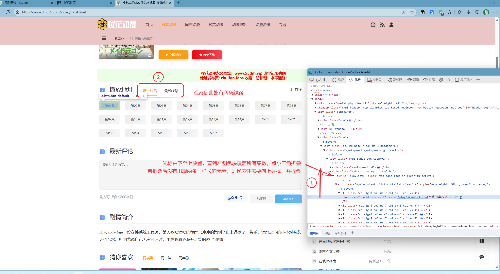
找到后就如下图：
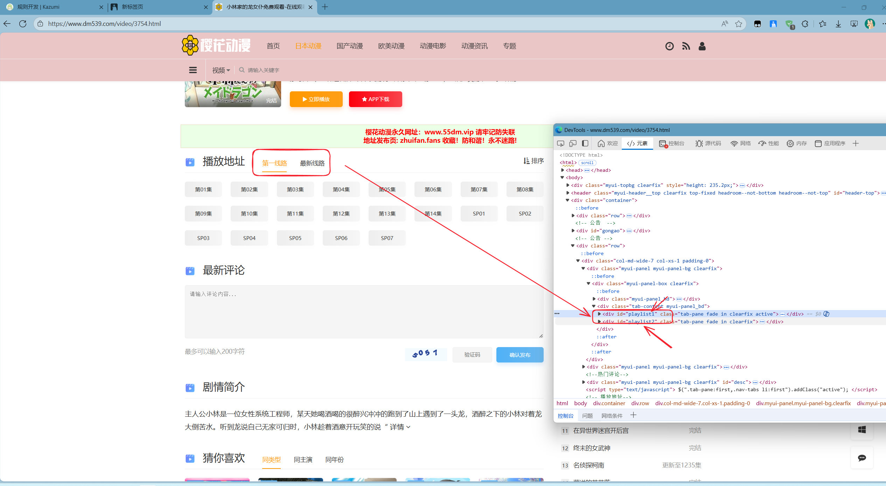

接着，我们复制这两个容器的父级Xpath，如下图：
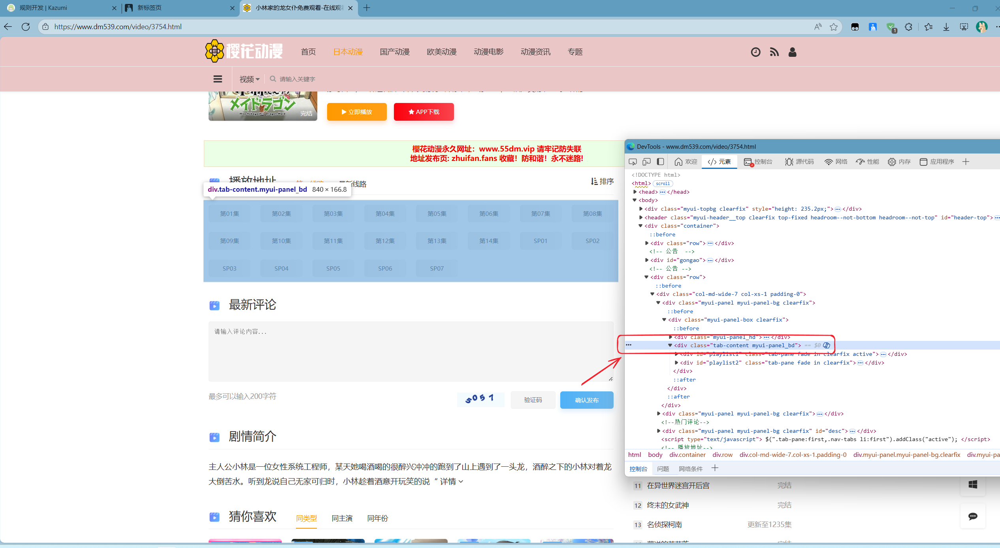

复制后你应该得到以下代码：
```Xpath
/html/body/div[2]/div[3]/div[1]/div[1]/div/div[2]
```
与之前一样，删除html与body，并且多打一个`/`

处理完成后应该是这样：
```Xpath
//div[2]/div[3]/div[1]/div[1]/div/div[2]
```
这条语句定位到的是其父级容器`div`本身，我们需要的是其子级容器`div`，所以我们应该在后面加上`//div`完成后应该如下：
```Xpath
//div[2]/div[3]/div[1]/div[1]/div/div[2]//div
```

### `ChapterResult`

最后，按照下图所示，第二步可随意点击任意集数，并且复制Xpath：


复制后得到(这里是复制的第12集)：
```Xpath
/html/body/div[2]/div[3]/div[1]/div[1]/div/div[2]/div[1]/ul/li[12]/a
```

同SearchName进行处理后得到：
```Xpath
//ul/li[12]/a
```
观察到精确定位到了`li[12]`也就是第12集，我们需要的是所有`li`而非单集`li`所以手动去除`[12]`完成后得到：
```Xpath
//ul/li/a
```
恭喜你！你已经学会了怎么写一个规则！  
如果你还是看不懂，或者希望看到动态的教程，可以在视频网站哔哩哔哩搜索“kazumi规则”  
下面，让我们进入你在写规则中可能遇到的一些常见问题！


## 规则开发常见问题

### 高级选项内容解释
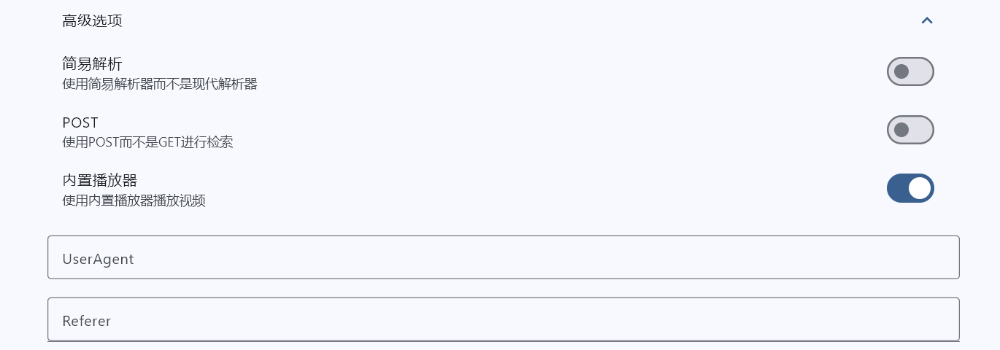

一般情况下，都不会用到这里面的设置，但不排除一些特殊情况。  
`简易解析`我不经常用，不清楚开关的区别，为避免误人子弟，这里暂不做解释，我个人的理解是简易解析就是老版本的解析算法。  
`POST`就是上面提到的，一些网站不能通过键入关键词搜索，我们可以在这里打开此开关，此情况请看后面内容。  
`内置播放器`推荐打开，若是遇到视频加载不出来，可尝试关闭。  
`UserAgent`User Agent 是浏览器在网络通信中自动发送的“身份标识”，用于告诉网站“我是谁”（什么浏览器、什么系统、什么设备），以便网站提供最合适的页面。虽然它因历史原因变得复杂且存在隐私顾虑，但它至今仍是 Web 生态中实现内容适配的关键技术之一。一般情况下不填。  
`Referer`Referer 是 HTTP 请求头的一个字段，它表示当前请求是从哪个网页或 URL 链接过来的。
例如，如果你在网页 A 上点击一个链接进入网页 B，那么浏览器在请求网页 B 时，会自动在 HTTP 头中包含 Referer 字段，其值为网页 A 的 URL。  
一些网站经常放不出视频，在这一行填上规则对应的baseurl即可。

### POST方式如何获得搜索链接

以 https://www.mengdao.tv/  为例子

随意键入什么进行搜索


呼出开发者工具，点到`网络`，并且进行重载：


然后点击`search.php`在右侧负载出可以看见表单内容：
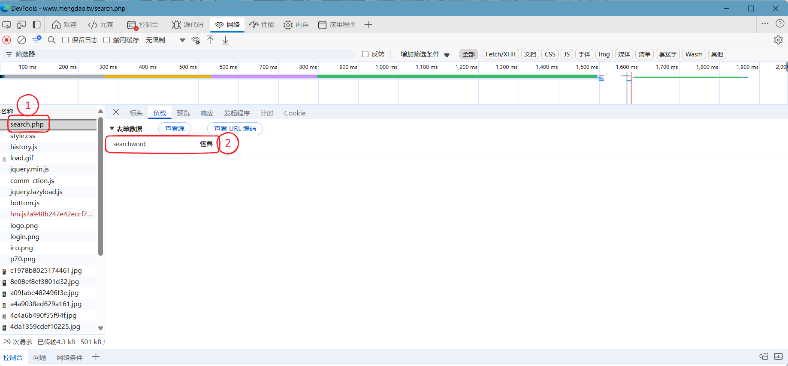

记住表单内容，通过地址栏获取地址，并且在最后加上`?searchword=@keyword`


完成后应该是：
```
https://www.mengdao.tv/search.php?searchword=@keyword
```
将上述填入`SearchURL`即可，记得在高级选项里打开POST


### 网页不允许呼出开发者工具

1.访问下述网站下载篡改猴浏览器插件，当然你也可用直接在Edge或者谷歌浏览器的插件商店中搜索并下载
```
https://www.crxsoso.com/search?keyword=%E7%AF%A1%E6%94%B9%E7%8C%B4&store=chrome
``` 
2.访问下述油猴脚本市场，搜索开发工具  
```
https://greasyfork.org/zh-CN/scripts
```
3.安装下述对应的反开发工具限制脚本即可，需要自己寻找，选择一个你喜欢的
```
https://greasyfork.org/zh-CN/scripts?q=%E5%BC%80%E5%8F%91%E8%80%85%E5%B7%A5%E5%85%B7
```


